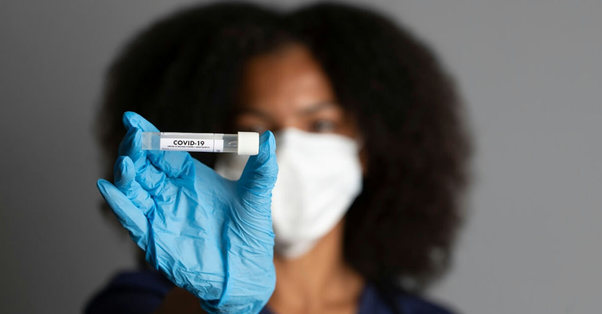

# COVID-19 Case Prediction


[](https://github.com/ellerbrock/open-source-badges/)

## Table of Contents

- [Project Overview](#project-overview)
- [Directory Structure](#directory-structure)
- [Installation](#installation)
  - [Using Docker](#using-docker)
  - [Local Setup](#local-setup)
- [Usage](#usage)
- [Data Description](#data-description)
- [Feature Engineering](#feature-engineering)
- [Model Details](#model-details)
- [Evaluation Metrics](#evaluation-metrics)
- [Contributing](#contributing)
- [License](#license)

## Project Overview

This project aims to predict the total imputed cases of COVID-19 using machine learning techniques. The project involves data preprocessing, feature engineering, model building, and evaluation. The primary model used in this project is XGBoost.




## Directory Structure
```sh
.
├── data
│ └── preprocessed_data_updated.csv
├── media
| |__ omdena_zambia_highres.png
| |__ img.jpg
| |__ omdena_logo.jpg
| |__ omdena.png
│ └── logo.jpg
├── 1_🏠_Home.py
├── frontend
│   └── streamlit.css
├── model
│   ├── xgb_model_total_deaths.pkl
│   └── xgb_model_total_imputed_cases.pkl
├── pages
│   ├── 2_📊_Overview.py
│   ├── 3_📈_EDA.py
│   └── 4_🤖_Model.py
├── predictions_page
│   ├── model_total_case_prediction.py
│   └── model_total_death_prediction.py
├── README.md
├── requirements.txt
└── utils
    ├── model_loader.py
    └── preprocessing.py


```


## Installation

 ### Local Setup

1. **Clone the Repository**

  ```sh
git clone https://github.com/yourusername/covid-case-prediction.git
cd covid-case-prediction

  ```

2.**Install Dependencies**

  ```sh
pip install -r requirements.txt
  ```


### Step 6: Usage

Provide instructions on how to prepare data, run the training script, and load/test the model.


## Usage

### Prepare Data

Ensure that your data file (preprocessed_data_updated.csv) is located in the data directory.


### Run the Application
To start the Streamlit application, run:

```sh
streamlit run 1_🏠_Home.py
```


### Step 7: Data Description

Describe the dataset and its key columns.

## Data Description

The dataset contains information about COVID-19 cases, vaccinations, tests, and various indices. Key columns include:

- `fullyVaccinated`: Number of fully vaccinated individuals.

- `new_deaths_smoothed`: Smoothed count of new deaths.

-  `new_people_vaccinated_smoothed`: Smoothed count of new people vaccinated.

- `new_vaccinations_smoothed`: Smoothed count of new vaccinations.
- `inated`: Number of partially vaccinated individuals.

- `stringency_index`: Government stringency index.
- `test24hours`: Number of tests conducted in 24 hours.
- `totalTests`: Total number of tests conducted.
- `totalVaccinations`: Total number of vaccinations.
- `vaccinated24hours`: Number of people vaccinated in 24 hours.
- `rfh`: Reproduction rate factor.
- `r3h`: Another reproduction rate factor.
- `month`: Month of the data point.
- `day_of_week`: Day of the week of the data point.


## Feature Engineering
Feature Engineering
Various features are engineered to improve the model's performance:

- **Differencing**: To make the data stationary, differencing is applied to features like `fullyVaccinated`, `new_people_vaccinated_smoothed`, `partiallyVaccinated`, `stringency_index`,` totalTests`, and `totalVaccinations`.

## Model Details
- **Data Preprocessing**: Handling missing values, scaling features, and applying differencing.
- **XGBoost Model**: A robust gradient boosting algorithm that works well with the provided features.

## Evaluation Metrics

The model is evaluated using the following metrics:
- **Mean Absolute Error (MAE)**: Measures the average magnitude of errors.
- **Root Mean Squared Error (RMSE)**: Measures the average magnitude of errors.
- **R² Score**: Indicates the proportion of the variance in the dependent variable that is predictable from the independent variables.


## Contributing

We welcome contributions to this project. Please submit pull requests with proper documentation and testing. For contributing to this project, please see [Contributing Guidelines](CONTRIBUTING.md) for more details.


## License

This project is licensed under the MIT License - see the  [LICENSE](LICENSE) file for details.

## Contact:
For any questions or feedback, please contact

## Link to the streamlit application
The application has been deployed on Streamlit community cloud. Link --->

## Screenshots from the application